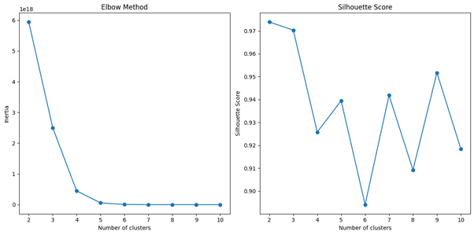

# Google Play Store Data Mining Project

This project focuses on performing end-to-end data mining on Google Play Store application datasets. The dataset consists of two CSV files:  
- A large dataset with approximately 450,000 records and 30 features.  
- A smaller dataset with around 10,000 records used for initial experiments and faster processing.

The features include application name, category, rating, rating count, installs, minimum installs, price, currency, size, minimum Android version, and other related attributes.

---

## Phase 1 – Data Understanding & Preprocessing

### 1. Exploratory Data Analysis
- Identified outliers in numerical features and visualized their distributions using box plots.

### 2. Missing Value & Outlier Analysis
- Analyzed missing values and abnormal data points to understand data quality issues.

### 3. Data Preprocessing
- Handled missing values using statistical methods such as mean and median.  
- Normalized numerical features to ensure scale consistency.  
- Performed feature engineering by combining primary attributes and adding new features.  
- Removed extreme outliers.  
- Converted numerical features into categorical variables where appropriate.  
- Applied text preprocessing techniques including lemmatization, stemming, and stopword removal.

### 4. Dataset Integration
- Merged the smaller dataset with the large dataset to create a unified clean dataset for further analysis.

---

## Phase 2 – Pattern Mining, Clustering & Classification

### 1. Frequent Pattern & Association Rule Mining
- Extracted frequent patterns (at least 7) from the cleaned dataset.  
- Generated association rules to discover hidden relationships between features.

### 2. Clustering & Classification

**Clustering:**
- Applied K-means clustering and determined the optimal number of clusters using the silhouette score.  
- Reduced data dimensionality using PCA for visualization.  
- Performed hierarchical clustering and visualized cluster structures using dendrograms.

**Classification:**
- Trained multiple classifiers including Random Forest, Decision Tree, Support Vector Machine, and Naive Bayes.  
- Evaluated models using accuracy, precision, recall, and F1-score.  
- Selected the best-performing model and conducted final evaluation.

---

## Technologies

- Python  
- pandas, NumPy  
- scikit-learn  
- matplotlib, seaborn

---

## Results & Visualizations

### Clustering Results

**Silhouette Analysis for K-means**

**PCA Visualization of Clusters**

**Hierarchical Clustering (Dendrogram)**

### Classification Evaluation

**Confusion Matrix – Best Model**

**Evaluation of the Best Model**

### Association Rules

**Top Frequent Patterns**

